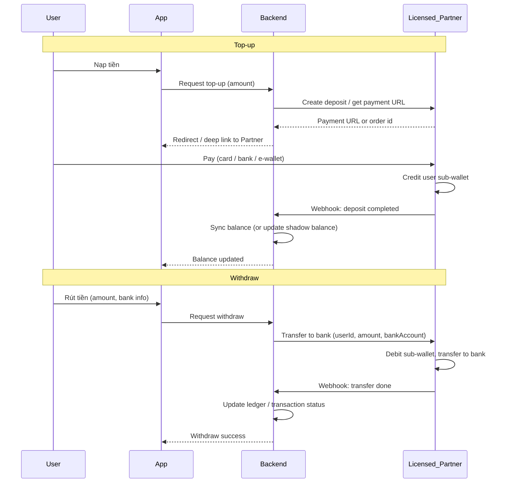

# Pass-through architecture – Licensed payment partner

This document outlines an optional architecture where **actual funds are held and moved by a licensed payment partner** (e.g. bank, licensed e-wallet in Vietnam). The app and backend act as a **facade**: they display balance and orchestrate flows, but the licensed partner performs nạp (top-up), rút (withdrawal), and optionally escrow. This reduces regulatory risk (VN and Apple) and keeps the app compliant with Guideline 3.2.1(viii).

---

## 1. Current vs pass-through model

| Aspect | Current (self-custody) | Pass-through (licensed partner) |
|--------|------------------------|---------------------------------|
| Who holds user balance? | Our backend (Wallet table) | Licensed partner (e.g. sub-wallet per user) |
| Top-up | User pays gateway → we credit Wallet | User pays via partner → partner credits; we sync balance |
| Withdraw | We deduct Wallet → we pay user bank | We request partner → partner transfers to user bank |
| Escrow | We hold in Wallet (pendingBalance) + EscrowHolding | Partner holds in escrow, or we keep ledger and partner does reserve/release |

---

## 2. High-level flow

---

## 3. Backend integration points

Current code to adapt (do not change in this doc; use as reference):

- **Wallet balance:** [backend/src/modules/wallet/wallet.service.ts](backend/src/modules/wallet/wallet.service.ts) – `getOrCreateWallet()` returns balance from DB. In pass-through, balance can come from **partner API** (e.g. get balance by user id) or from a **synced shadow table** updated by webhooks.
- **Top-up:** `topUp(userId, amount, paymentMethod, externalTxId)` is today called after our payment gateway callback. In pass-through, replace with: (1) create deposit request with partner, (2) return partner’s payment URL / order id to app, (3) on partner webhook “deposit completed”, call existing `topUp()` or update shadow balance and transaction log.
- **Withdraw:** `requestWithdraw(userId, amount, bankInfo)` today deducts from our Wallet and creates a PENDING transaction. In pass-through: (1) call partner “transfer to bank” API with userId (or partner’s user ref), amount, bank details, (2) on partner webhook “transfer done”, update transaction status and optionally sync balance from partner.
- **Booking payment (escrow):** Today `deductPayment()` decrements user balance and we have `EscrowHolding` + `pendingBalance`. Options: (a) Partner supports escrow (reserve/release) – we call partner to reserve on booking pay and release on complete; (b) Partner only does balance; we keep escrow logic in our ledger and when releasing we call partner to credit partner’s wallet (and we only record, not hold, the money).

---

## 4. API surface (backend ↔ partner)

Suggested minimal API the backend needs from the licensed partner:

| Operation | Backend → Partner | Partner → Backend (webhook/callback) |
|-----------|-------------------|-------------------------------------|
| Get balance | `GET /users/:userId/balance` or equivalent | — |
| Initiate top-up | `POST /deposits` (userId, amount, returnUrl, notifyUrl) → payment URL or order id | `POST /webhooks/deposit-completed` (orderId, userId, amount, status) |
| Withdraw | `POST /withdrawals` (userId, amount, bankName, bankAccountNo, bankAccountName) | `POST /webhooks/withdrawal-completed` (withdrawalId, status) |
| Escrow (if partner supports) | `POST /reserve` (bookingId, payerId, payeeId, amount), `POST /release` (bookingId) or `POST /refund` (bookingId) | `POST /webhooks/escrow-released` (bookingId, status) |

If the partner does not support escrow, the backend keeps the current `EscrowHolding` and booking flow; only **actual money in/out** (top-up, withdraw, and optionally pay-out to partner) go through the partner.

---

## 5. Data model (minimal changes)

- **Wallet table:** Can remain for **display and caching**: e.g. `balance` = last known balance from partner (updated by webhooks or periodic sync). Or remove balance from DB and always fetch from partner when needed (simpler but more latency).
- **Transaction table:** Keep for history. `externalTxId` already stores partner reference; add `partnerOrderId` / `partnerWithdrawalId` if needed. Status updates (e.g. PENDING → COMPLETED) on partner webhooks.
- **EscrowHolding:** Unchanged if escrow is still handled in our backend; only the “cash” movement (user pay-in, partner pay-out) goes through the licensed partner.

---

## 6. Mobile app changes

- **Top-up:** Instead of redirecting to our payment gateway, open partner’s payment URL (or in-app SDK) and return to app on success; backend receives webhook and updates balance; app can poll balance or use push/websocket.
- **Withdraw:** Same UX; backend calls partner; success/failure and status come from backend based on partner webhooks.
- **Balance:** Continue to call existing wallet API; backend returns balance from DB (synced from partner) or from partner in real time.

---

## 7. Implementation order

1. **Choose partner** (licensed e-wallet or bank in VN) and get API docs and webhook specs.
2. **Implement top-up:** Create deposit with partner → redirect user → handle deposit-completed webhook → update balance/transaction.
3. **Implement withdraw:** Call partner withdrawal API → handle withdrawal-completed webhook → update transaction status.
4. **Escrow (if needed):** Either integrate partner escrow APIs or keep current escrow logic and only move “real” money via partner for pay-in and pay-out.

After implementation, update [VN_LEGAL_REVIEW_CHECKLIST.md](VN_LEGAL_REVIEW_CHECKLIST.md) and [APP_STORE_REVIEW_NOTES.md](APP_STORE_REVIEW_NOTES.md) (e.g. “Payments and escrow are processed by [Partner name], a licensed intermediary payment provider”).
